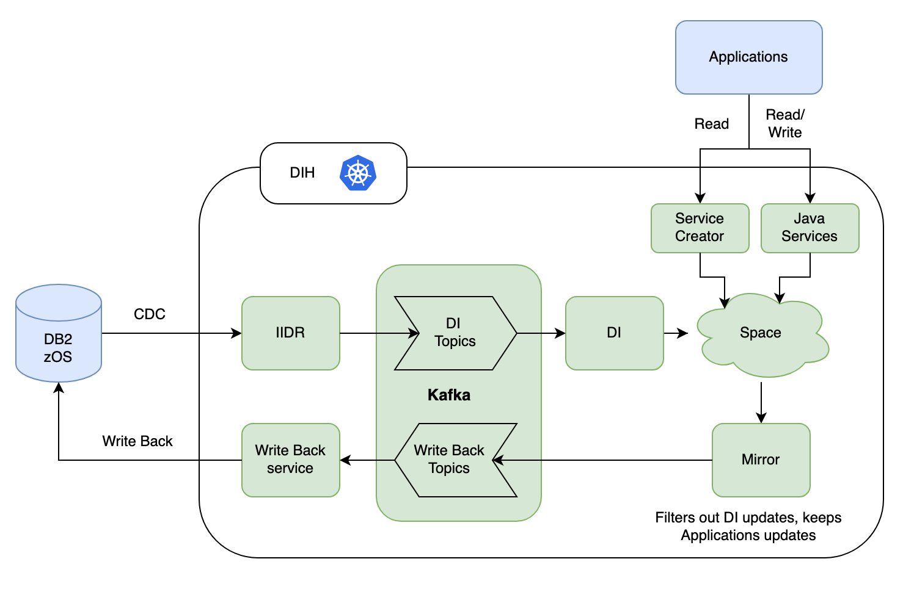

# Build and Deploy Instructions

## Architecture   

---

## 🔧 Build and Deployment Instructions

### 🔁 Environment Setup

```sh
export VERSION=0.6
export SPACE_VERSION=0.7
export CONSUMER_VERSION=0.13
```

---

### 🚫 Uninstall Existing Deployment (if any)

```sh
helm uninstall mirror -n dih
helm uninstall space -n dih
kubectl delete -f ./Travelers-POC/Services/example/write-back/deployment.yaml
```

---

### 🏗️ Build and Push Docker Images

1. **Maven Build**

```sh
cd ./Travelers-POC/Services
mvn clean install
```

2. **Authenticate with ECR**

```sh
aws ecr-public get-login-password --region us-east-1 | docker login --username AWS --password-stdin public.ecr.aws/dih-ppc64le
```

3. **Push Services to aws ecr**

```sh
# SPACE
cd ./Travelers-POC/Services/example/space
docker build -t travelers/space:$SPACE_VERSION .
docker tag travelers/space:$SPACE_VERSION public.ecr.aws/dih-ppc64le/travelers/space:$SPACE_VERSION
docker push public.ecr.aws/dih-ppc64le/travelers/space:$SPACE_VERSION

# MIRROR
cd ../mirror
docker build -t travelers/mirror:$VERSION .
docker tag travelers/mirror:$VERSION public.ecr.aws/dih-ppc64le/travelers/mirror:$VERSION
docker push public.ecr.aws/dih-ppc64le/travelers/mirror:$VERSION

# FEEDER
cd ../feeder
docker build -t travelers/feeder:$VERSION .
docker tag travelers/feeder:$VERSION public.ecr.aws/dih-ppc64le/travelers/feeder:$VERSION
docker push public.ecr.aws/dih-ppc64le/travelers/feeder:$VERSION

# WRITEBACK (Consumer)
cd ../write-back
docker build -t travelers/writeback-service:$CONSUMER_VERSION .
docker tag travelers/writeback-service:$CONSUMER_VERSION public.ecr.aws/dih-ppc64le/travelers/writeback-service:$CONSUMER_VERSION
docker push public.ecr.aws/dih-ppc64le/travelers/writeback-service:$CONSUMER_VERSION
```

---

### 🚀 Install Services

```sh
# Install Space PU
helm install space dihrepo/xap-pu \
  --version 17.0.1-patch-b-1 \
  --set instances=0,partitions=1,ha=true,resourceUrl=pu.jar,image.repository=public.ecr.aws/dih-ppc64le/travelers/space,image.tag=$SPACE_VERSION \
  -n dih

# Install Mirror PU
helm install mirror dihrepo/xap-pu \
  --version 17.0.1-patch-b-1 \
  --set instances=1,partitions=0,resourceUrl=pu.jar,image.repository=public.ecr.aws/dih-ppc64le/travelers/mirror,image.tag=$VERSION \
  -n dih

# Deploy Writeback service
kubectl apply -f ./Travelers-POC/Services/example/write-back/deployment.yaml
```

---

## ▶️ Running the Demo

### 🧹 Pre-Setup Cleanup

- Deploy Space, Mirror, and Writeback services
- Recreate Kafka topic
- Delete existing pipelines
- Ensure DB2 tables are created and contain data ([db2-queries.sql](example/script/db2-queries.sql))

### ✅ Pre-Check

- Space has no types/data
- PostgreSQL has no tables
- Kafka topic is empty
- No pipeline exists for Space
- DB2 tables to verify:

```sql
SELECT * FROM TRAV.CUSTOMER;
SELECT * FROM TRAV.PRODUCT;
SELECT * FROM TRAV.ORDERS;
```

---

### 🔄 Create and Validate Data Pipeline

1. **Create Pipelines in Spacedeck using DB2 Data Source**
2. **Create service in Spacedeck**
    - Example:
        - `customer-service` → `SELECT * FROM CUSTOMER WHERE ID=$ID` (basic query)
        - `order-service` → `SELECT ORDER_ID, PRODUCT_NAME, TOTAL_AMOUNT FROM ORDERS JOIN PRODUCT ON ORDERS.PRODUCT_ID = PRODUCT.PRODUCT_ID WHERE ORDER_ID=$ORDER_ID`  (query with join)

2. **Verify:**
    - Data appears in Space
    ```sql
    SELECT * FROM CUSTOMER ORDER BY ID; 
    SELECT * FROM ORDERS  ORDER BY ORDER_ID;  
    SELECT * FROM PRODUCT ORDER BY PRODUCT_ID; 
    ```
    - API returns data using Swagger
    - Kafka topic (no data initially as DI data will be filtered out)
    - PostgreSQL still empty (no tables created)

---

## 🧪 Test Data Changes

### 🔁 DB2 → SpaceDeck
#### Execute below queries in db2 (cdc changes will be shown on space). So after executing each query show space data.
```sql
-- Insert
INSERT INTO TRAV.CUSTOMER (ID, NAME, CUSTOMER_EMAIL, CREATEDDATE) VALUES (11, 'Kevin ThompsonDB2', 'kevin.db2@gmail.com', DATE('2024-11-01'));

INSERT INTO TRAV.ORDERS (ORDER_ID, PRODUCT_ID, CUSTOMER_ID, SHIPPING_ADDRESS, BILLING_ADDRESS, ORDER_DATE, DELIVERY_DATE, ORDER_STATUS, QUANTITY, TOTAL_AMOUNT, PAYMENT_METHOD, CREATED_AT, UPDATED_AT)
VALUES (1010, 100, 1, '123 Maple St, NY', '123 Maple St, NY', DATE('2024-07-05'), NULL, 'Pending', 1, 29.99, 'Credit Card', DATE('2024-07-05'), DATE('2024-07-05'));


-- Update
UPDATE TRAV.CUSTOMER SET CUSTOMER_EMAIL = 'kevin.thompson-updated@outlook.com' WHERE ID = 11;

-- Delete
DELETE FROM TRAV.CUSTOMER WHERE ID = 11;
```

### 🔁 SpaceDeck → Postgres
#### Execute below queries in spacedeck (changes will reflected in Postgres, it will create tables if not exist in Postgres)
```sql
-- Insert
INSERT INTO CUSTOMER (ID, NAME, CUSTOMER_EMAIL, CREATEDDATE) VALUES (12, 'Charlie Spacedeck', 'charlie.spacedeck1@gmail.com', '2024-12-01');
INSERT INTO CUSTOMER (ID, NAME, CUSTOMER_EMAIL, CREATEDDATE) VALUES (13, 'ALice Spacedeck', 'charlie.spacedeck2@gmail.com', '2024-12-01');

-- Update
UPDATE CUSTOMER SET NAME='Charlie12 Spacedeck-updated' WHERE ID=12;

-- Delete
DELETE FROM CUSTOMER WHERE ID=13;
```

---

## 🧹 Environment Cleanup

Run the cleanup script to reset your environment:

```sh
# Note: update deployment yaml file path in  3-removeSpaceMirrorWBservice.sh, 6-deploySpaceMirrorWBservice.sh as per your path
cd ./Travelers-POC/Services/example/script/
./cleanupAll.sh
```

This will:

- Remove pipelines
- Stop SpaceDeck services
- Drop PostgreSQL tables
- Recreate Kafka topic
- Redeploy Space, Mirror, and Writeback services

---

## ✅ Summary

This demo shows a complete data flow between DB2 → Space , Application -> Space → PostgreSQL using Kafka and writeback service.

---