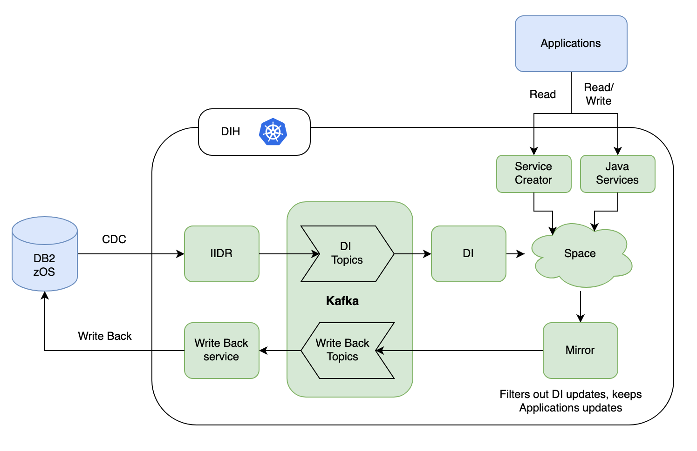

# Travelers Data Integration Demo

## Architecture   

---

## 🔧 Build and Deployment Instructions

### 🔁 Environment Setup

```sh
export VERSION=0.6
export SPACE_VERSION=0.7
export CONSUMER_VERSION=0.13
```

---

### 🚫 Uninstall Existing Deployment

```sh
helm uninstall mirror -n dih
helm uninstall space -n dih
kubectl delete -f deployment.yaml
```

---

### 🏗️ Build and Push Docker Images

1. **Maven Build**

```sh
cd ./Travelers-POC/Services
mvn clean install
```

2. **Authenticate with ECR**

```sh
aws ecr-public get-login-password --region us-east-1 | docker login --username AWS --password-stdin public.ecr.aws/dih-ppc64le
```

3. **Build and Push Services**

```sh
# SPACE
cd ./Travelers-POC/Services/example/processor
docker build -t travelers/space:$SPACE_VERSION .
docker tag travelers/space:$SPACE_VERSION public.ecr.aws/dih-ppc64le/travelers/space:$SPACE_VERSION
docker push public.ecr.aws/dih-ppc64le/travelers/space:$SPACE_VERSION

# MIRROR
cd ../mirror
docker build -t travelers/mirror:$VERSION .
docker tag travelers/mirror:$VERSION public.ecr.aws/dih-ppc64le/travelers/mirror:$VERSION
docker push public.ecr.aws/dih-ppc64le/travelers/mirror:$VERSION

# FEEDER
cd ../feeder
docker build -t travelers/feeder:$VERSION .
docker tag travelers/feeder:$VERSION public.ecr.aws/dih-ppc64le/travelers/feeder:$VERSION
docker push public.ecr.aws/dih-ppc64le/travelers/feeder:$VERSION

# WRITEBACK (Consumer)
cd ../consumer-postgres
docker build -t travelers/writeback-service:$CONSUMER_VERSION .
docker tag travelers/writeback-service:$CONSUMER_VERSION public.ecr.aws/dih-ppc64le/travelers/writeback-service:$CONSUMER_VERSION
docker push public.ecr.aws/dih-ppc64le/travelers/writeback-service:$CONSUMER_VERSION
```

---

### 🚀 Install Services

```sh
# Install Space PU
helm install space dihrepo/xap-pu \
  --version 17.0.1-patch-b-1 \
  --set instances=0,partitions=1,ha=true,resourceUrl=pu.jar,image.repository=public.ecr.aws/dih-ppc64le/travelers/space,image.tag=$SPACE_VERSION \
  -n dih

# Install Mirror PU
helm install mirror dihrepo/xap-pu \
  --version 17.0.1-patch-b-1 \
  --set instances=1,partitions=0,resourceUrl=pu.jar,image.repository=public.ecr.aws/dih-ppc64le/travelers/mirror,image.tag=$VERSION \
  -n dih

# Deploy Consumer to Postgres
kubectl apply -f ./Travelers-POC/Services/example/consumer-postgres/deployment.yaml
```

---

## ▶️ Running the Demo

### 🧹 Pre-Setup Cleanup

- Deploy Space, Mirror, and Writeback services
- Recreate Kafka topic
- Delete existing pipelines
- Ensure DB2 tables are created and contain data

### ✅ Pre-Check

- Space has no types/data
- PostgreSQL has no tables
- Kafka topic is empty
- No pipeline exists for Space
- DB2 tables to verify:

```sql
SELECT * FROM TRAV.CUSTOMER;
SELECT * FROM TRAV.PRODUCT;
SELECT * FROM TRAV.ORDERS;
```

---

### 🔄 Create and Validate Data Pipeline

1. **Create Pipelines via Data Source**
    - Example pipelines:
        - `customer-service` → `SELECT * FROM CUSTOMER WHERE ID=$ID`
        - `order-service` → `SELECT ORDER_ID, PRODUCT_NAME, TOTAL_AMOUNT FROM ORDERS JOIN PRODUCT ON ORDERS.PRODUCT_ID = PRODUCT.PRODUCT_ID WHERE ORDER_ID=$ORDER_ID`

2. **Verify:**
    - Data appears in Space
    - API returns data
    - Kafka topic shows filtered traffic
    - PostgreSQL still empty

---

## 🧪 Test Data Changes

### 🔁 DB2 → SpaceDeck

```sql
-- Insert
INSERT INTO TRAV.CUSTOMER (ID, NAME, CREATEDDATE) VALUES (10, 'Charlie-12', '2025-06-30');

INSERT INTO TRAV.ORDERS VALUES 
(1012, 1, 'Alice Johnson', 'alice.johnson@example.com', '123 Main St, NY', '123 Main St, NY', DATE('2025-07-01'), DATE('2025-07-05'), 'Shipped', 2, 51.98, 'Credit Card', CURRENT TIMESTAMP, CURRENT TIMESTAMP);

-- Update
UPDATE TRAV.CUSTOMER SET NAME = 'Alice Smith1 updated' WHERE ID = 11;

-- Delete
DELETE FROM TRAV.CUSTOMER WHERE ID = 10;
```

### 🔁 SpaceDeck → Postgres

```sql
-- Insert
INSERT INTO CUSTOMER (ID, NAME, CREATEDDATE) VALUES (12, 'Charlie-12-spacedeck', '2025-06-30');

-- Update
UPDATE CUSTOMER SET NAME='Alice11-spacedeck-updated' WHERE ID=12;

-- Delete
DELETE FROM CUSTOMER WHERE ID=12;
```

---

## 🧹 Environment Cleanup

Run the cleanup script to reset your environment:

```sh
# Note: update deployment yaml file path in  3-removeSpaceMirrorWBservice.sh, 6-deploySpaceMirrorWBservice.sh as per your path
cd ./Travelers-POC/Services/example/script/
./cleanupAll.sh
```

This will:

- Remove pipelines
- Stop SpaceDeck services
- Drop PostgreSQL tables
- Recreate Kafka topic
- Redeploy Space, Mirror, and Writeback services

---

## ✅ Summary

This demo shows a complete data flow between DB2 → Space , Application -> Space → PostgreSQL using Kafka and writeback service.

---